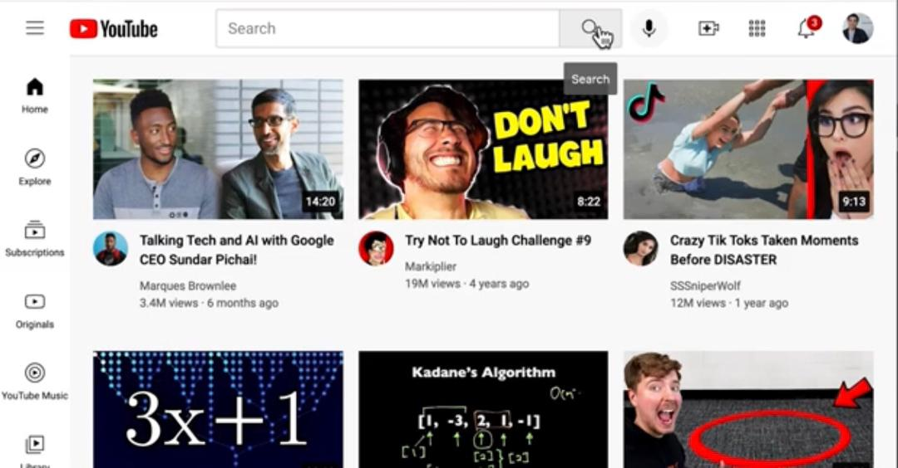

# YouTube-clone-HTML-CSS-
A simple clone of the YouTube homepage built using HTML and CSS. This project focuses on layout design, responsiveness, and recreating a real-world UI.

## Overview
This is a front-end clone of the YouTube homepage, built using pure HTML and CSS.
The goal was to practice modern layout techniques and recreate a real-world user interface with attention to structure, spacing, and responsiveness.

## Features
* Fully structured YouTube-style layout.
* Responsive design for different screen sizes.
* Navigation bar with search and icons.
* Sidebar menu.
* video grid with thumbnails and metadata.
* Clean and organized UI.

## Technologies Used
 * HTML5 --semantic structure
 * CSS3 -- styling and layout
    -Flexbox
    -Css Grid

## Learning Objectives
Through this project, i focused on:
* Building real-world layouts from scratch
* Combining Flexbox and Grid effectively
* Improving responsive design skills
* Writing clean and maintainable code

## Preview
